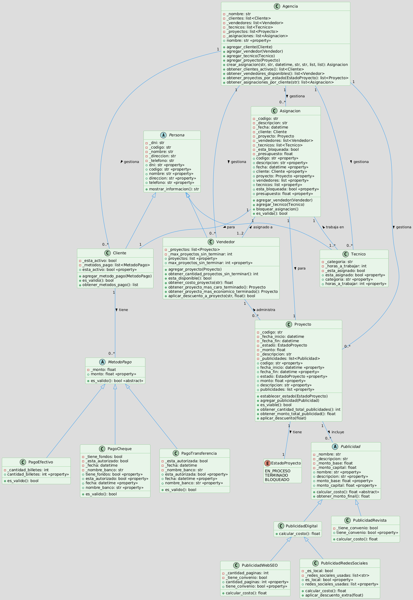

# Sistema de Gestión de Agencia de Marketing

Este proyecto implementa un sistema de gestión para una agencia de marketing, modelado bajo los principios de la Programación Orientada a Objetos (POO) en Python 3.13.5. El sistema maneja clientes, vendedores, técnicos, proyectos, asignaciones y diferentes tipos de publicidad y métodos de pago.

## Instrucciones de Uso

1. Clonar este repositorio o descarga el archivo `main.py`.
2. Abrir una terminal y navega hasta la ubicación del archivo `main.py`.
3. Ejecutar el programa con el comando `python3 main.py`.

Se mostrará por consola el funcionamiento del algoritmo.

## Diagrama de Clases

